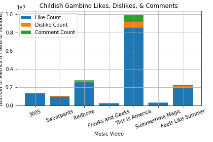
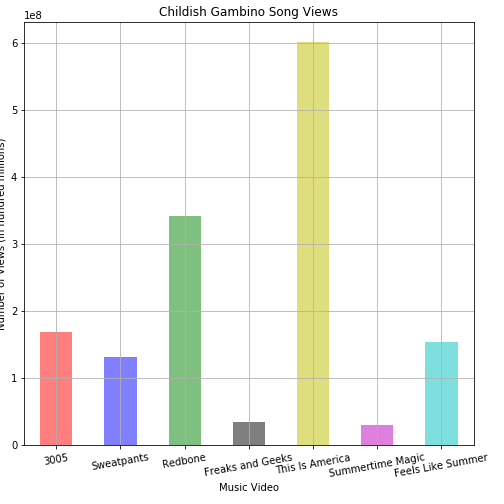
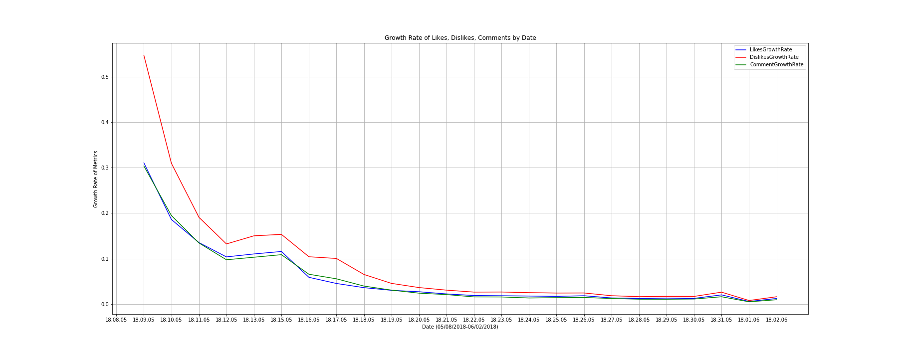
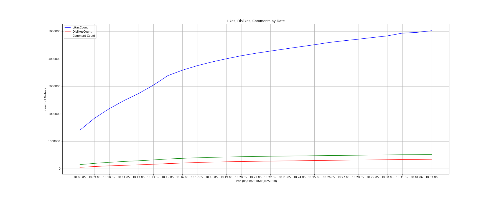

# Controversial-Music

As a first capstone project, Controversial Music ventures into the minds of various artists and musical titans. Living in a decade filled with contemporary perspectives and controversial ideals, one may wonder if creating a career based on controversial viewpoints can lead to more viewership and, therefore, higher profits. Using advanced Python methods, this project aims to visualize the profitability and popularity of various artists who were, at one time, beyond notorious because of an infamous song that ushered them into infamy. 
-------------------------------------------------------------------------
Below are images as previews for the analysis:
-------------------------------------------------------------------------

-------------------------------------------------------------------------

-------------------------------------------------------------------------

-------------------------------------------------------------------------

-------------------------------------------------------------------------
